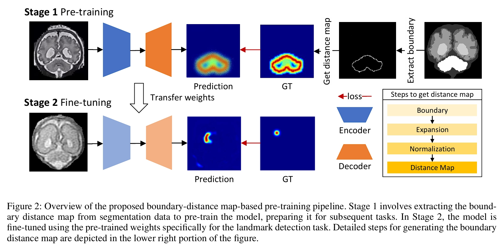
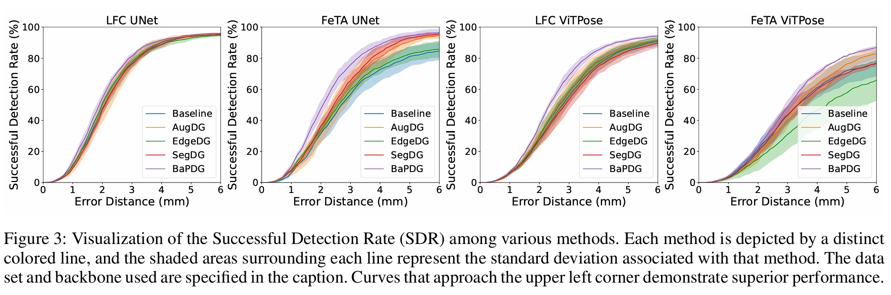

# Domain Generalized Medical Landmark Detection via Robust Boundary-aware Pre-training (AAAI-2025)

## Introduction
In recent years, deep learning has made significant advances in the field of automated medical landmark detection. However, most studies focus on single-center scenarios or domain adaptation. The acquisition of multi-center data presents challenges including privacy concerns and the high costs of data collection and annotation. To address these challenges, we propose a novel framework for domain-generalized medical landmark detection, leveraging single-center data to enhance domain generalization capabilities.




## Methodology
Our approach utilizes public medical segmentation datasets to pre-train a model focused on regions critical for landmark detection. We introduce a novel boundary-aware pre-training strategy along with a mixing loss function to enhance robustness and generalization.

## Results


You should download data from [Google Drive Folder](https://drive.google.com/drive/folders/1PVOi5dX4SSjbZ4TqjRPZhfewj7fgFY9p?usp=drive_link) and unzip them to the corresponding dir to reproduce the results.

## Repository Structure

- `landmark_pretraining/`: Contains code for pre-training the model.
  - `pretrain.sh`: Bash script to run pre-training.
- `landmark_detection/`: Contains code for the downstream task of landmark detection.
  - `train.sh`: Bash script to start training.
  - `eval.sh`: Bash script to run inference.
- `runs/`: Directory for saving training weights and logs.

## Environment Setup

To set up the necessary environment for running the provided code, please use the `environment.yml` file included in the repository. You can create a Conda environment with the required packages by running the following command in your terminal:
```
conda env create -f environment.yml
```

## Getting Started

### Downloading Data
The dataset for the detection task can be downloaded from the provided web disk links. Please place the downloaded data in the appropriate directory for further processing.

### Pre-training
Navigate to the `landmark_pretraining` directory and execute the pre-training script by entering the following in your terminal:
```
cd landmark_pretraining
./pretrain.sh
```

### Training and Evaluation
After pre-training, navigate to the `landmark_detection` directory to start training and evaluation. Run the following commands:
```
cd ../landmark_detection
./train.sh
./eval.sh
```


## Citation
To cite our work, please use the following format:
```
@inproceedings{gong2025domain,
  title={Domain Generalized Medical Landmark Detection via Robust Boundary-aware Pre-training},
  author={Gong, Haifan and Yu, Lu, and Wan, Xiang and Li, Haofeng},
  booktitle={Proceedings of the AAAI Conference on Artificial Intelligence},
  pages={1--9},
  year={2025}
}
'''
